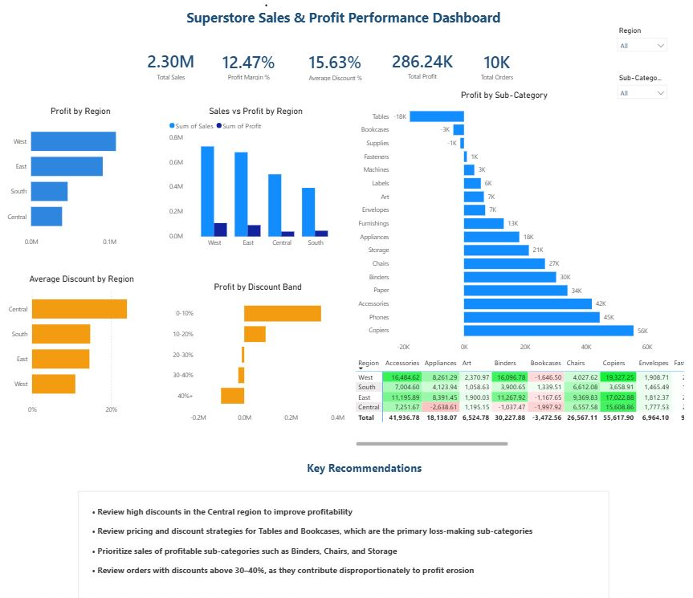

# Superstore Sales & Profit Performance Dashboard

## Project Overview
This project analyzes Superstore sales and profitability using SQL, Excel, and Power BI. The objective is to identify the key factors impacting business performance and provide actionable recommendations through an interactive executive dashboard.

## Business Problem

- Why is revenue increasing while profit is declining?
- Which regions are underperforming?
- Which products require immediate business attention?
## Tools & Technologies Used

| Tool / Technology | Purpose |
|-------------------|---------|
| **PostgreSQL** | Imported and managed the Superstore dataset for SQL analysis. |
| **SQL** | Performed business analysis using Aggregate Functions, GROUP BY, HAVING, Common Table Expressions (CTEs), Window Functions (RANK), Subqueries, CASE statements, and ORDER BY. |
| **Microsoft Excel** | Conducted data cleaning, exploratory data analysis (EDA), Pivot Tables, Pivot Charts, Conditional Formatting, and statistical analysis including Correlation Analysis, and Regression Analysis to validate business insights. |
| **Power BI** | Built an interactive executive dashboard using Power Query, DAX Measures, KPI Cards, Bar Charts, Matrix Visuals, Slicers, Conditional Formatting, and interactive filtering. |
| **Git & GitHub** | Managed project versioning, documentation, and portfolio presentation. |

## Dataset

This project uses the **Sample Superstore** dataset, a retail sales dataset containing approximately **10,000 order records**.
**Source:** [Kaggle - Sample Superstore Dataset](https://www.kaggle.com/datasets/bravehart101/sample-supermarket-dataset)

The dataset includes transactional information such as:

- Ship Mode
- Segment
- Product Category & Sub-Category
- Country
- Region
- Sales
- Profit
- Discount
- Quantity
- City
- State
- Postal Code
- Quantity

## Business Questions

This project aims to address the following key business questions:

1. Why is revenue increasing while overall profit is declining?
2. Which regions are underperforming in terms of profitability?
3. Is discounting a major factor affecting profit margins?
4. Which product contribute the most to business losses?
5. What actionable recommendations can improve overall business profitability?

## Dashboard Preview

## Key Insights

- Despite generating higher sales than the South region, the Central region recorded the lowest profit.
- The Central region offered the highest average discounts, indicating a strong relationship between excessive discounting and declining profitability.
- Orders with discounts above 30% consistently resulted in losses.
- Tables and Bookcases emerged as the largest loss-making sub-categories.
- The Power BI dashboard enables interactive exploration of regional and product-level performance using slicers and KPI cards.

The dataset was used to analyze sales performance, profitability, discount patterns, and regional business performance to answer key business questions.
